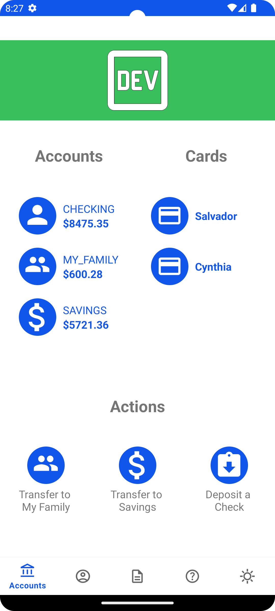
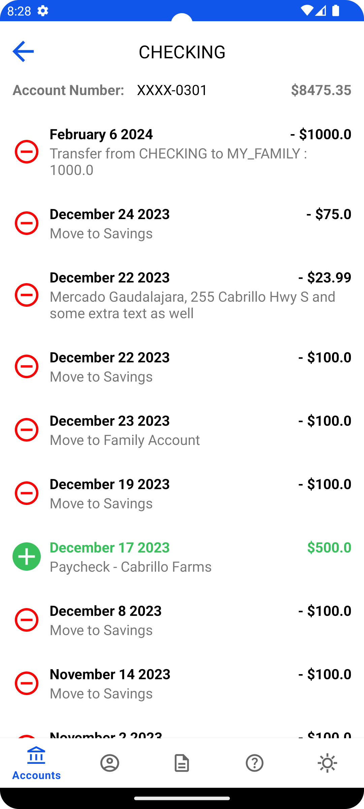
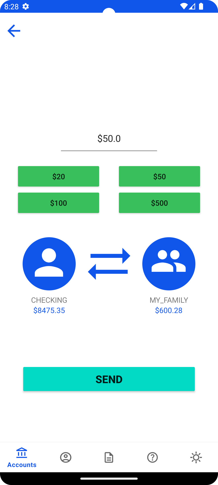
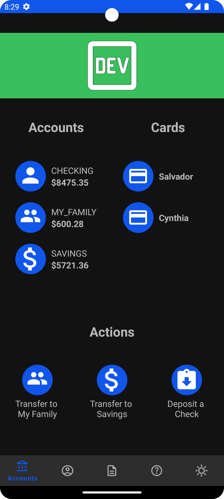
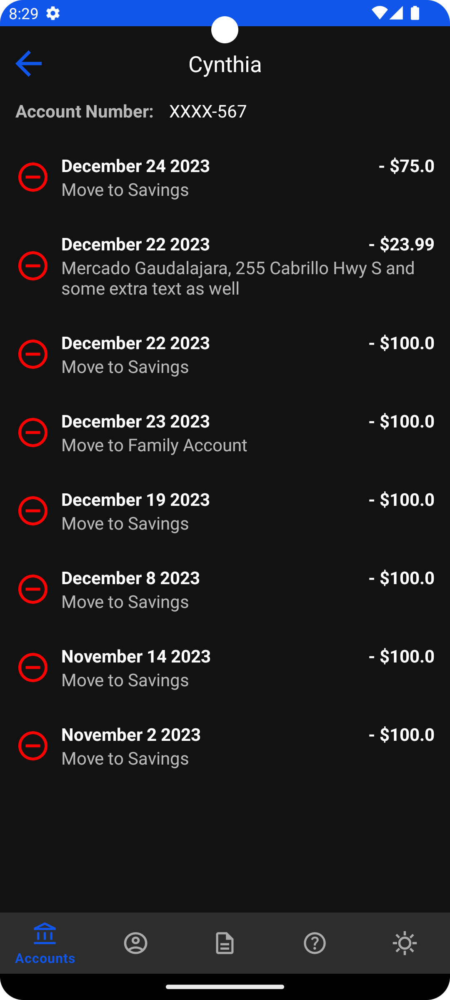
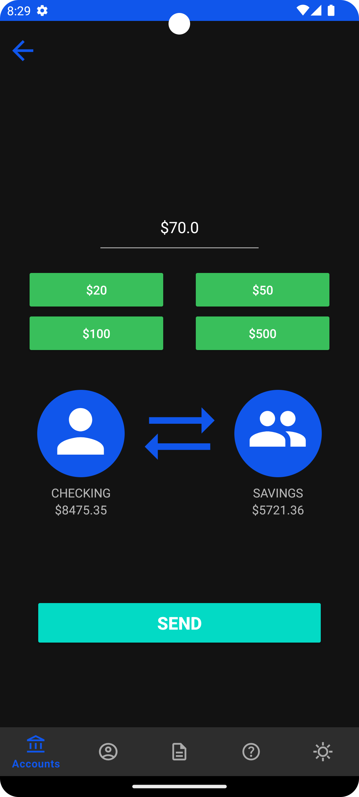

# Bank TranXer

## Introduction

This App implements a few features to highlight some of my Android coding style. It is a simple app
that displays a users bank account information and allows them to view their transactions as well as
create new transactions through account transfers.

## Tech

- [kotlin]  & XML
- [retrofit]  for network calls
- [koin] for dependency injection
- [mvvm] app Architecture
- [navigation] - for native in-app navigation

## Build Env.

Download Android Studio Hedgehog | 2023.1.1 Patch 2
Java target v 1_8

## Main Features

### Account Home Screen

The main Landing screen allows you to view all your account quickly and has many paths to navigate
to complete the many task that this app will allow you to perform.

### Transactions Feed

You can click on account from within the Home-screen to view the transaction associated with that
particular account.

### Transfer Money From Checking Account

This feature allows you to transfer money out of your primary checking account into other accounts
linked to the user.

### Darkmode

I built the app around themes so I was able to leverage dark mode and setup a good looking color
schema

 
 

## Development Improvements

- If I have more time I would love to go back and upgrade my binding from view binding to data
  binding to help clean up some of the calls to click listeners.
- I also would like to externalize/internationalize all my string. I was able to get most of them
  but there are a few places I hardcoded to save time.
- I didn't get a chance to write unit tests, but I usually do, I would defiantly need to do some
  testing around the account transfers

[kotlin]: <https://kotlinlang.org/>

[Retrofit]: <https://square.github.io/retrofit/>

[koin]: <https://insert-koin.io/>

[navigation]: <https://developer.android.com/guide/navigation>

[mvvm]: <https://developer.android.com/topic/libraries/architecture/viewmodel>

